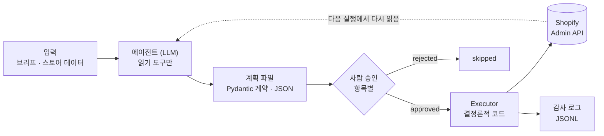
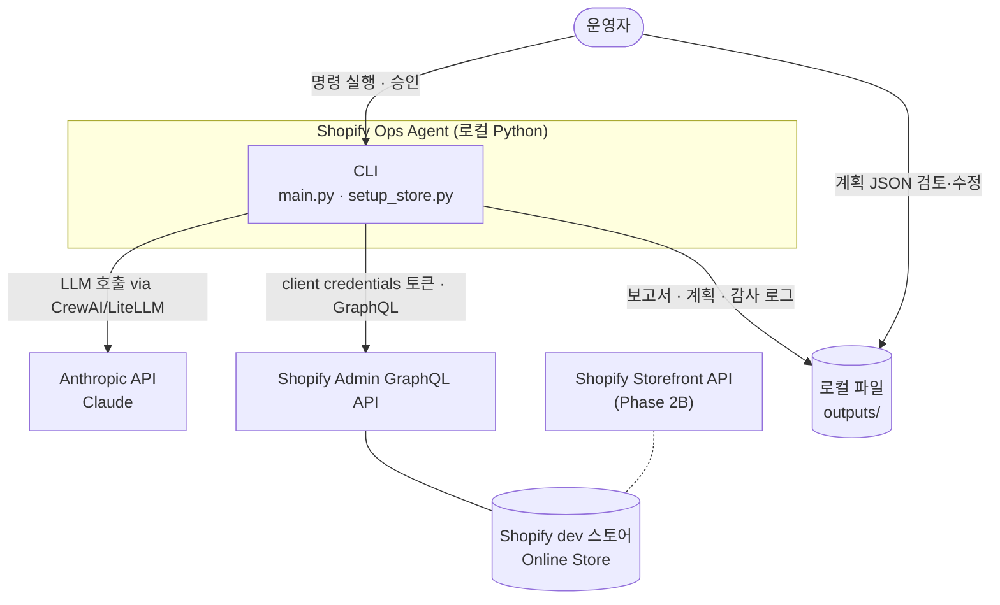
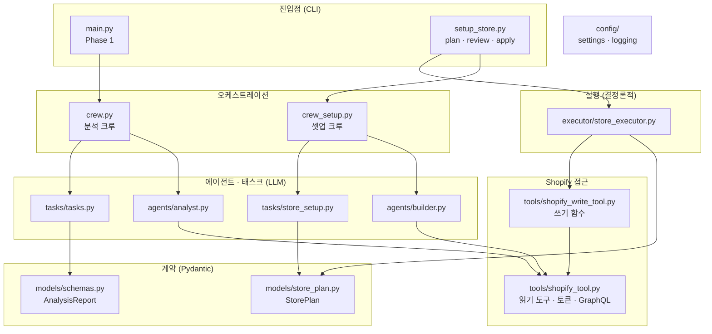
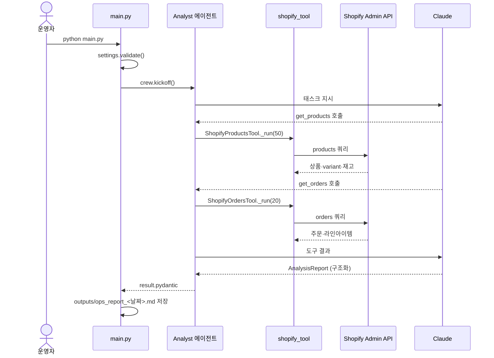
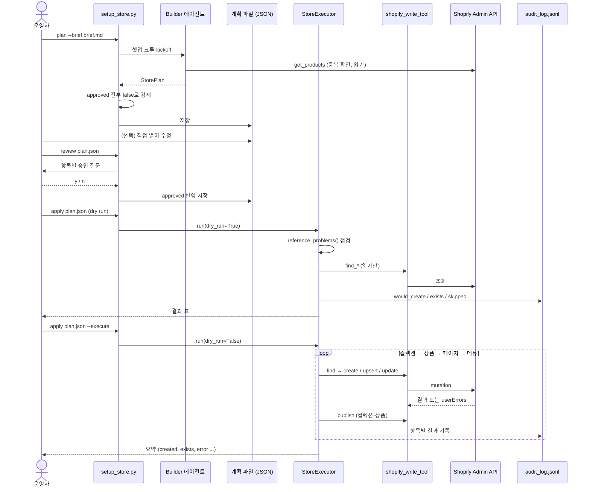
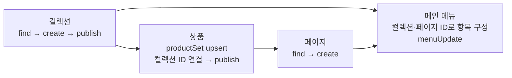
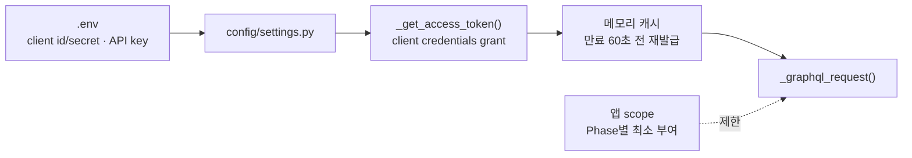
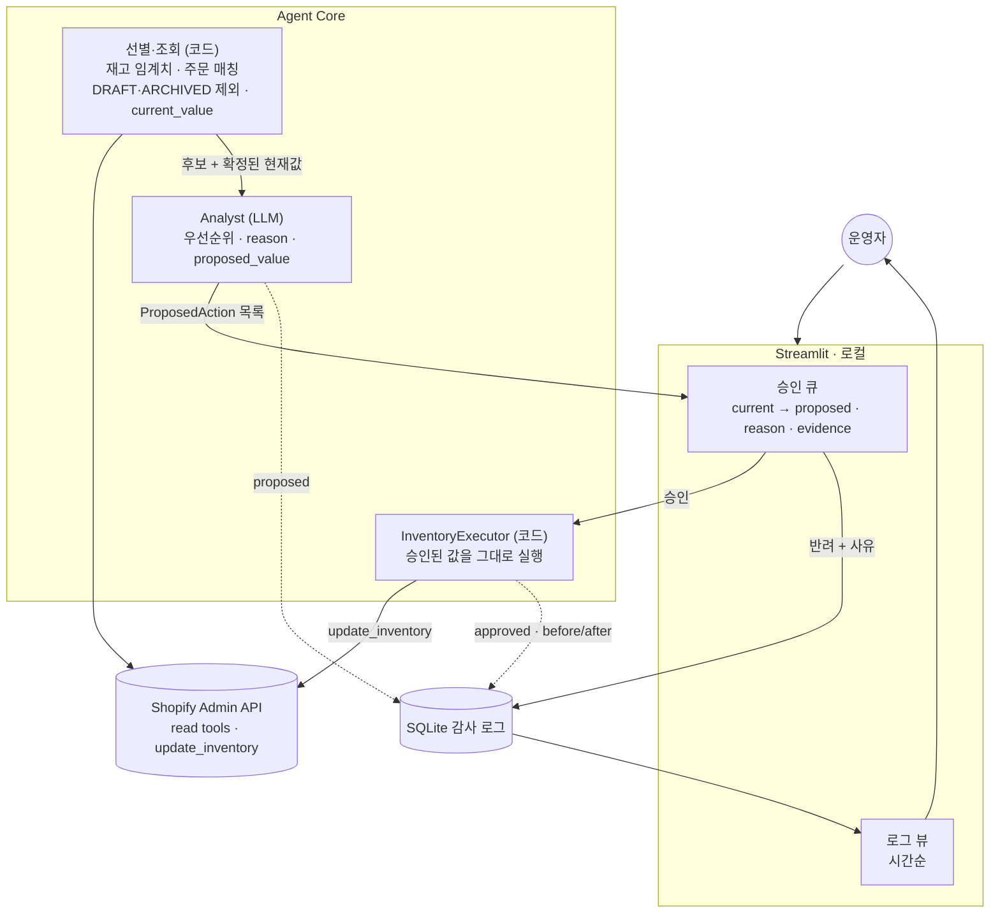
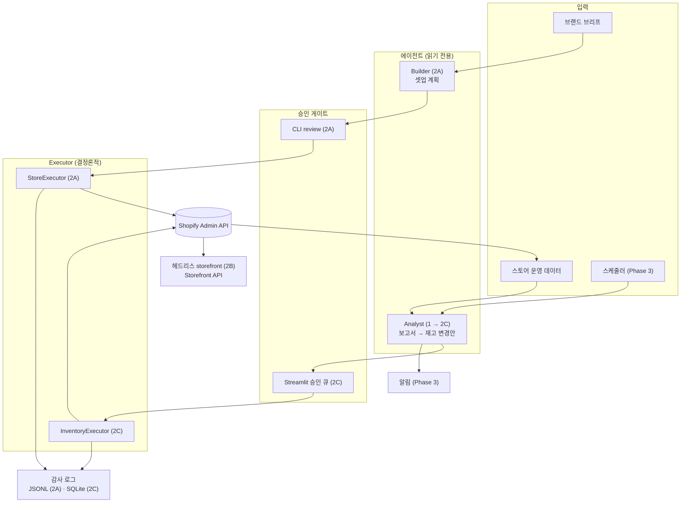

# Architecture — Shopify Ops Agent

| 항목 | 내용 |
|---|---|
| 문서 상태 | Phase 1·2A 구현 기준, 2B·2C·3은 목표 구조 |
| 관련 문서 | [REQUIREMENTS.md](REQUIREMENTS.md) · [TECH_SPEC.md](TECH_SPEC.md) |

---

## 1. 한 줄 요약

**에이전트는 읽고 제안만 하고, 사람이 승인한 항목만 결정론적 Executor가 Shopify에 쓴다.**
모든 기능(분석, 셋업, 운영 조치)은 이 하나의 파이프라인 위에 올라간다.

---

## 2. 시스템 컨텍스트

| 외부 시스템 | 용도 | 인증 |
|---|---|---|
| Anthropic API | Analyst·Builder 에이전트의 LLM | `ANTHROPIC_API_KEY` |
| Shopify Admin GraphQL API | 읽기(상품·주문·컬렉션·페이지·메뉴), 쓰기(2A부터) | client credentials → 24시간 access token |
| Shopify Storefront API | 헤드리스 프론트 (2B) | Storefront access token (예정) |

---

## 3. 레이어 구조

### 3.1 레이어별 책임과 규칙

| 레이어 | 책임 | 규칙 |
|---|---|---|
| 진입점 | 인자 파싱, 설정 검증, 결과 출력·저장 | 비즈니스 로직 없음. 2C의 Streamlit도 같은 원칙(화면은 얇게, 로직은 모듈에) |
| 오케스트레이션 | 에이전트와 태스크를 Crew로 조립 | 기능별로 크루 분리 (분석 크루를 셋업이 건드리지 않음) |
| 에이전트·태스크 | 판단과 제안 | **읽기 도구만**. 출력은 반드시 Pydantic 계약 |
| 계약 | 에이전트 ↔ 사람 ↔ Executor 사이 데이터 형식 | 검증은 여기서. 교차 참조는 별도 메서드로 점검 |
| 실행 | 승인된 항목을 Shopify에 적용 | LLM 호출 없음. dry run 기본. 항목별 오류 격리. 감사 로그 |
| Shopify 접근 | 토큰 관리, GraphQL 요청, 응답 해석 | 쓰기 함수는 CrewAI 도구로 노출하지 않음 |

### 3.2 의존 방향

- 위 레이어만 아래 레이어를 import한다. `tools/`는 `agents/`나 `executor/`를 모른다.
- 예외: `tools/shopify_write_tool.py`는 `models/store_plan.py`의 Draft 타입을 입력으로 받는다. 계약이 쓰기 함수의 입력 형식이기 때문이다.
- `executor/`는 `tools/shopify_write_tool` 모듈을 **주입받는다**(`api` 인자). 테스트에서는 가짜 API로 교체한다.

---

## 4. 주요 흐름

### 4.1 Phase 1 — 운영 분석

### 4.2 Phase 2A — 스토어 셋업

### 4.3 적용 순서와 의존성

상품은 컬렉션 ID가, 메뉴는 컬렉션·페이지 ID가 있어야 만들 수 있다. 그래서 순서를 코드로 고정했다.

---

## 5. 핵심 설계 결정 (ADR 요약)

### ADR-1. LLM에게 쓰기 도구를 주지 않는다

- **결정:** Analyst·Builder는 읽기 도구만 갖는다. 쓰기는 Executor(일반 Python 코드)만 한다.
- **이유:** 에이전트가 직접 쓰면 잘못된 판단이 바로 스토어에 반영되고, 재현도 어렵다. 계획을 거치면 최악의 경우에도 "나쁜 제안"이 사람 앞에 놓일 뿐이다.
- **대가:** 에이전트가 한 번에 끝내지 못하고 단계가 늘어난다. 운영자 승인이 병목이 될 수 있다.
- **대안:** CrewAI 도구로 쓰기를 노출하고 human-in-the-loop 콜백으로 확인 → 승인 시점이 LLM 루프 안에 묻혀 감사·재실행이 어려워 기각.

### ADR-2. 계획은 파일이다

- **결정:** 에이전트 출력은 Pydantic 모델로 검증한 뒤 JSON 파일로 저장한다.
- **이유:** 사람이 읽고, diff하고, 손으로 고칠 수 있다. 같은 계획을 다시 적용할 수 있다. 승인 UI가 CLI에서 다른 화면으로 바뀌어도 형식은 그대로다.
- **대가:** 파일 관리가 필요하다 (`outputs/plans/`, git 제외).

### ADR-3. 기본은 dry run

- **결정:** `apply`는 `--execute` 없이는 쓰지 않는다. dry run도 스토어를 읽는다.
- **이유:** "실수로 실행"을 구조적으로 막는다. 읽기를 하면 dry run 결과가 실제 실행과 거의 같아진다(이미 있는 handle 표시).

### ADR-4. handle 기반 멱등성

- **결정:** 모든 리소스를 handle(URL slug)로 식별한다. 컬렉션·페이지는 조회 후 없을 때만 생성하고, 상품은 `productSet` + handle identifier로 upsert한다.
- **이유:** 중간에 실패해도 같은 계획을 다시 돌리면 이어서 완료된다. 별도 상태 저장소가 필요 없다.
- **대가:** 기존 컬렉션·페이지 내용은 갱신하지 않는다("exists, left unchanged"). 상품의 컬렉션 연결은 `productSet` 특성상 전체 교체된다 (REQUIREMENTS R-4).

### ADR-5. 실패는 항목 단위로 격리

- **결정:** 한 항목이 실패하면 기록하고 다음 항목으로 넘어간다. 계획 자체가 일관되지 않으면 시작 전에 전체를 거부한다.
- **이유:** 부분 성공도 진전이며, 감사 로그와 멱등성 덕분에 재실행으로 마무리할 수 있다. 반대로 참조가 깨진 계획은 부분 적용하면 더 꼬이므로 아예 막는다.

### ADR-6. CrewAI + Pydantic 계약

- **결정:** 에이전트 프레임워크는 CrewAI, 출력은 `output_pydantic`으로 강제한다.
- **이유:** 같은 개발자의 다른 프로젝트(daily-briefing-agent)와 스택 통일. 출력 계약 덕분에 다음 단계가 자유 텍스트를 파싱하지 않는다.
- **대가:** CrewAI·LiteLLM의 기본값 문제(예: `max_tokens`)에 영향을 받는다. 에이전트마다 `max_tokens=16384`를 명시한다.

### ADR-7. 쓰기 함수는 CrewAI 도구가 아니다

- **결정:** `tools/shopify_write_tool.py`는 일반 함수만 둔다.
- **이유:** 실수로 에이전트의 `tools=[...]`에 추가되는 경로 자체를 없앤다. ADR-1을 코드 구조로 강제한다.

---

## 6. 데이터와 저장소

| 데이터 | 위치 | 형식 | 수명 | git |
|---|---|---|---|---|
| 설정·키 | `.env` | dotenv | 영구 | 제외 |
| access token | 프로세스 메모리 (`_token_cache`) | dict | 약 24시간 | — |
| 분석 보고서 | `outputs/ops_report_<날짜>.md` | Markdown | 영구 | 제외 (데모용 1개 예외 가능) |
| 스토어 계획 | `outputs/plans/store_plan_<날짜>.json` | StorePlan JSON | 영구 | 제외 |
| 감사 로그 | `outputs/audit_log.jsonl` | JSON Lines, append-only | 영구 | 제외 |
| 실행 로그 | `outputs/logs/run_<시각>.log` | 텍스트 | 영구 | 제외 |
| 브랜드 브리프 | `briefs/*.md` | Markdown | 영구 | 포함 |

데이터베이스는 쓰지 않는다. 진실의 원천(source of truth)은 Shopify이고, 로컬 파일은 계획과 기록뿐이다.

---

## 7. 보안 구조

| 위협 | 대응 |
|---|---|
| 키 유출 | `.env`만 사용, git 제외, 토큰은 디스크에 쓰지 않음 |
| 에이전트의 의도치 않은 변경 | 쓰기 도구 미보유 (ADR-1, ADR-7) |
| 프롬프트 인젝션 (상품명·주문 메모 등 스토어 데이터 경유) | 에이전트가 쓸 수 없으므로 영향은 "제안 왜곡"으로 제한, 사람 리뷰에서 차단 |
| 과도한 권한 | Phase 1은 읽기 3종, 쓰기 scope는 2A에서 필요한 것만 추가 |
| 실 스토어 사고 | dev 스토어 전용으로 검증, dry run 기본 |

---

## 8. 목표 구조 (Phase 2B · 2C · 3)

### 8.1 Phase 2C — 재고 승인 게이트 (설계 확정 2026-07-29)

2C는 2A와 같은 원칙(LLM 제안 → 사람 승인 → 코드 실행)을 **운영 데이터**에 적용한다. 2A와 다른 점은 두 가지다. 승인 화면에 뜨는 현재값을 **코드가 조회**한다는 것, 그리고 승인 UI·기록이 **Streamlit + SQLite**라는 것이다.

**읽는 법:** Analyst에서 Executor로 가는 직선이 없다. 둘 사이에 반드시 사람이 낀다. 그리고 승인 큐의 현재값은 LLM이 아니라 코드(선별·조회)에서 온다. 승인 화면의 숫자가 검증되지 않으면 승인 자체가 근거를 잃는다.

| 결정론 경계 | 코드가 한다 | LLM이 한다 |
|---|---|---|
| 대상 선별 | 재고 ≤ `LOW_STOCK_THRESHOLD`, 최근 주문 매칭, DRAFT·ARCHIVED 제외 | 어느 것부터 급한가 |
| 값 | `current_value` 조회 | `proposed_value` 제안 |
| 설명 | — | `reason`, `evidence` |

Phase 1은 임계치가 `settings.py`에 있었지만 규칙의 **적용**은 LLM이 했다. 2C에서 이 경계를 코드로 고정한다.

**2A와의 관계 (열린 결정):** 2A 감사 로그는 JSONL 파일, 2C는 SQLite 테이블이다. 2C 착수 시 2A 기록을 같은 테이블로 옮길지, 두 형식을 유지할지 정한다. 2A의 승인 게이트(CLI `review`)를 2C의 Streamlit 화면으로 합칠지도 그때 정한다.

### 8.2 전체 목표 구조

| Phase | 추가 요소 | 기존 구조에서 재사용하는 것 |
|---|---|---|
| 2B | 헤드리스 프론트 (Hydrogen 또는 Next.js), Storefront API 토큰 | 2A가 만든 상품·컬렉션·페이지·메뉴 데이터 그대로 |
| 2C | `ProposedAction` 계약, 선별·조회 코드, SQLite 감사 로그, Streamlit 화면 2개(승인 큐·로그 뷰), `update_inventory` 쓰기 함수, `InventoryExecutor` | Analyst 크루(출력 계약만 교체), 토큰·GraphQL 레이어, `_raise_user_errors`, "쓰기 함수는 도구가 아니다" 원칙 |
| 3 | 스케줄러(cron 또는 scheduled task), 알림 채널 | Analyst 크루. 알림은 승인 대기 항목만 만들고 실행하지 않음 (FR-3.3) |

설계상 새 기능은 "새 계약 + 새 Executor"를 추가하는 방식이고, 승인 게이트와 감사 로그 원칙은 공유한다.
